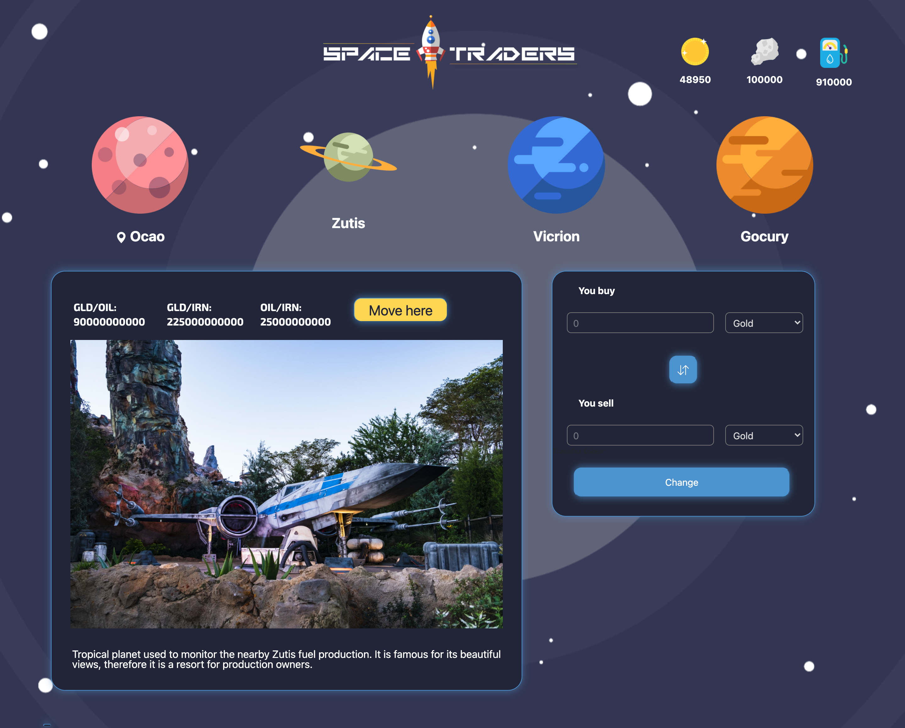
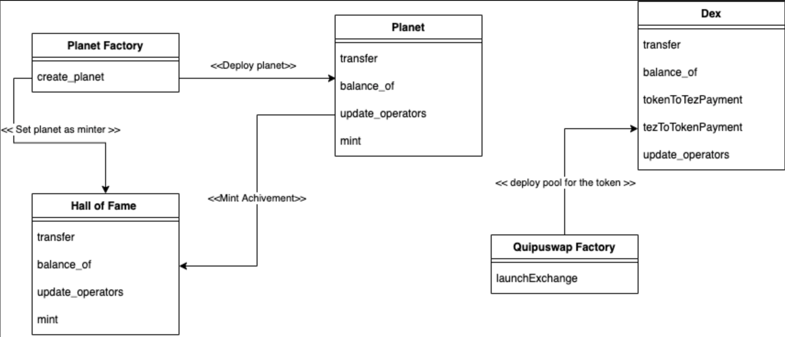

# TezosHack — проект "Космические трейдеры"

В рамках хакатона был реализован прототип DeFi-игры "Космические трейдеры" для экосистемы Tezos. 

# Мотивация 

В экосистеме Tezos гейминг — одно из приоритетных направлений развития протокола. Cлияние технологий NFT и DeFi сможет привлечь новых пользователей в экосистему, вдобавок ко всему, игры на блокчейн позволяют геймерам не просто наслаждаться процессом игры, но и получать награду в цифровой валюте :)

# Игровая механика

В игре реализовано 4 различные планеты (смарт-контракты), на которых с некоторой периодичностью в различных пропорциях минтится 3 типа ресурсов: золото (GOLD), топливо (FUEL), металл (IRON). 

Главный ресурс — золото (GOLD), его можно получить за XTZ или обменять обратно после игры. 
Внутри игры GOLD можно обменивать на топливо (FUEL) и металл (IRON). 

Топливо (FUEL) необходимо для перемещений игрока между планетами. Перемещение занимает несколько блоков в сети и зависит от уровня корабля, повышать уровень можно за счет токенов металла (IRON). 

Каждая планета представляет собой UniSwap и каждой планеты свои пулы ликвидности ресурсов (благодаря AMM). Пулы ликвидности меняются благодаря торговле ресурсами в рамках планеты и заложенной изначально природы планеты (есть планеты-нефтедобытчики, а есть металло-добытчики, а есть где все в равных пропорциях минтится). 

Таким образом, войдя в игру и купив золото GOLD за Tezos (XTZ) можно заработать больше золота за счет совершения обменных операций внутри игры (благодаря AMM на каждой планете). 

# Стек технологий

В рамках хакатона были реализованы контракты Planet и PlanetFactory + задействовано ядро QuipuSwap для обмена токенами. В данный момент обмен осузествляется через токен-посредник XTZ.  

В дальнейшем планируется усовершенствовать ядро QuipuSwap для обмена токенами внутри FA2 и доработать логику получения NFT-токенов через разблокировку достижений.

